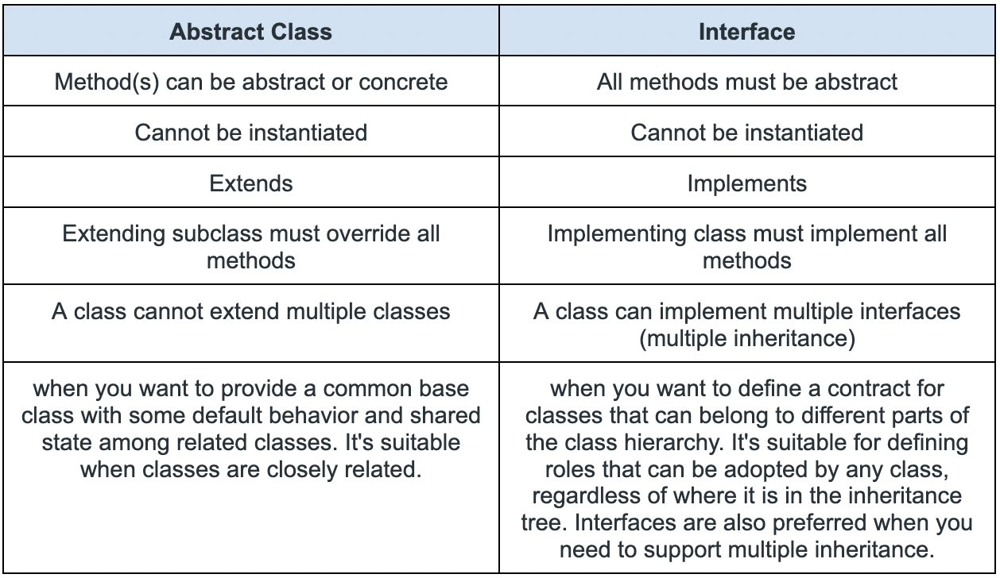

# Basic Java

## Terminology

### 1. Inheritance
The property that allows a subclass to inherit the properties (fields, methods, constructors) of its super class.
Benefits:
- Code reusability
- Method overriding
- Polymorphism

### 2. Polymorphism
The property of allowing us to perform a single action in different ways. Inheritance lets us inherit attributes and methods from another class. Polymorphism uses those methods to perform different tasks.
For example, think of a superclass called _Animal_ that has a method called _animalSound()_. Subclasses of Animals could be _Pigs_, _Cats_, _Dogs_, _Birds_ - And they also have their own implementation of an animal sound (the pig oinks, and the cat meows, etc.):
- Compile time / Static polymorphism (method overloading): having methods with the same name in a class but with different parameters, different return type(optional)
- Runtime polymorphism (method overriding): redefining/overriding a method in the subclass that is already present in the superclass.  

### 3. Encapsulation
The property of bundling the data (fields, methods) inside the object & exposing only the required components outside the object. Its done by "private" keyword.  
Benefits:
- Security & Access Control (data hiding)
- Flexible implementation of classes
- Modular design of code

### Dependency Injection
### Inversion of Control (IoC)

### Abstract Classes Vs Interface

