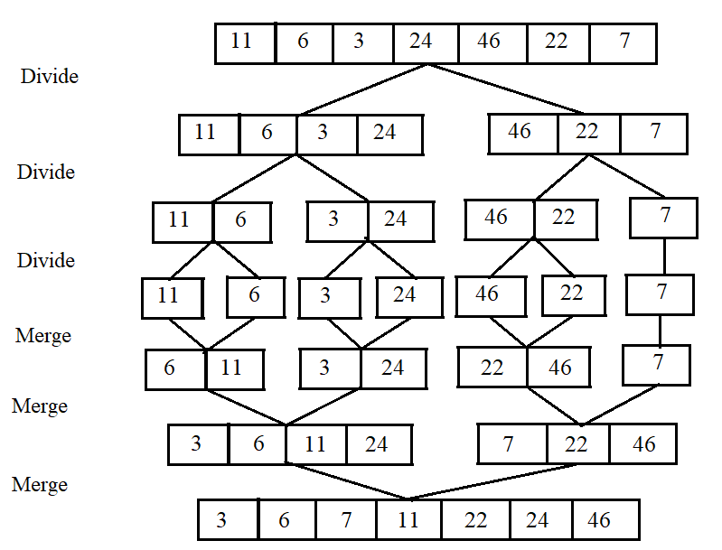

## Sorting Techniques
### Terminology
1. **Stability** : When two same data appear in the same order in sorted data without changing their position.
2. **In-place** : When algorithm uses constant space for producing the output (modifies the given array only)
3. **Internal** : When all the data is placed in the main memory or internal memory. In internal sorting, the problem cannot take input beyond its size.

### 1. Selection Sort
Repeatedly select the lowest/highest element from the unsorted part of the list & place it after the sorted part of the list.  
  
**Time Complexity:** O(n^2) in all cases  
**Space Complexity:** O(1)  
❌ Stable (default) (can me made stable)  
✔️ In-place  
✔️ Internal

### 2. Bubble Sort
Repeatedly swap the adjacent elements if they're in the wrong order, bringing the highest element to the end in each iteration.  
  
**Time Complexity:** O(n^2) in worst & avg, O(n) in best cases (already sorted)  
**Space Complexity:** O(1)  
✔️ Stable  
✔️ In-place  
✔️ Internal

### 3. Insertion Sort
Iteratively insert each element of an unsorted list into its correct position in the sorted portion of the list.        
  
**Time Complexity:** O(n^2) in worst & avg, O(n) in best cases (already sorted)  
**Space Complexity:** O(1)  
✔️ Stable  
✔️ In-place  
✔️ Internal

### 4. Merge Sort
Recursively divide the input into smaller sub-arrays and sort those & merge them back by Divide & Conquer approach.  
  
This one of the most optimised & most used sorting algos.  
**Time Complexity:** O(n logn)  
**Space Complexity:** O(n)  
✔️ Stable  
❌ In-place  
❌ Internal

### 5. 
